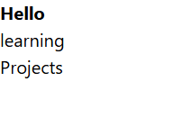

# YAGBFP

## Idea

I was working on this github documentation but the issue with this was I was not able to write in this while I was working on a project, So I am making this a full fledge app where I can even connect it with Github to Showcase my Projects.

## Process

Learning Vue Framework and how Nuxt Works

- I am keeping bookmarks of everything in my chrome bookmarks bar.
- I learned about SEO, Meta Tags, Title and dynamic Titles
- These things are not something that will help but I am maybe getting a hang of it.
- I learned about the Nuxt page router and implemented that in the app.the routes are looking kinda weird to me but I will figure them Out

here is the first snapshot of the routes I made during working on this project.

## Building

I am making the Navbar part of the page
